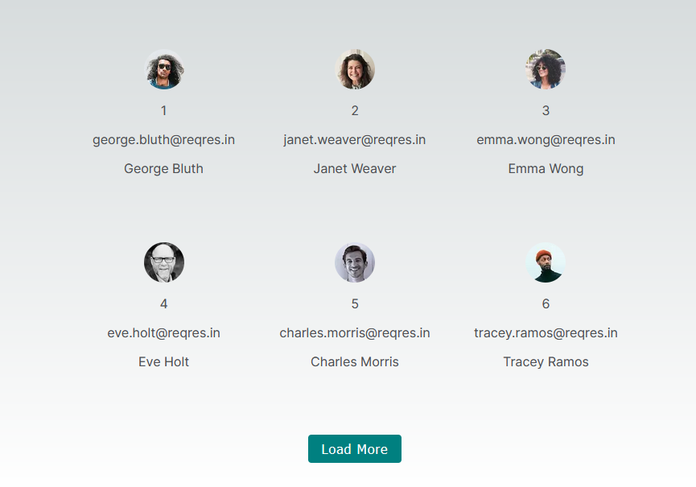

# NextJS and Typescript App

      

- Fetch users from https://reqres.in/
- Display users
  - Display 6 users on first fetch
- Use nextjs image component
  - configure `next.config.js`
- Add styling
- Move to different components
- Add Head component
